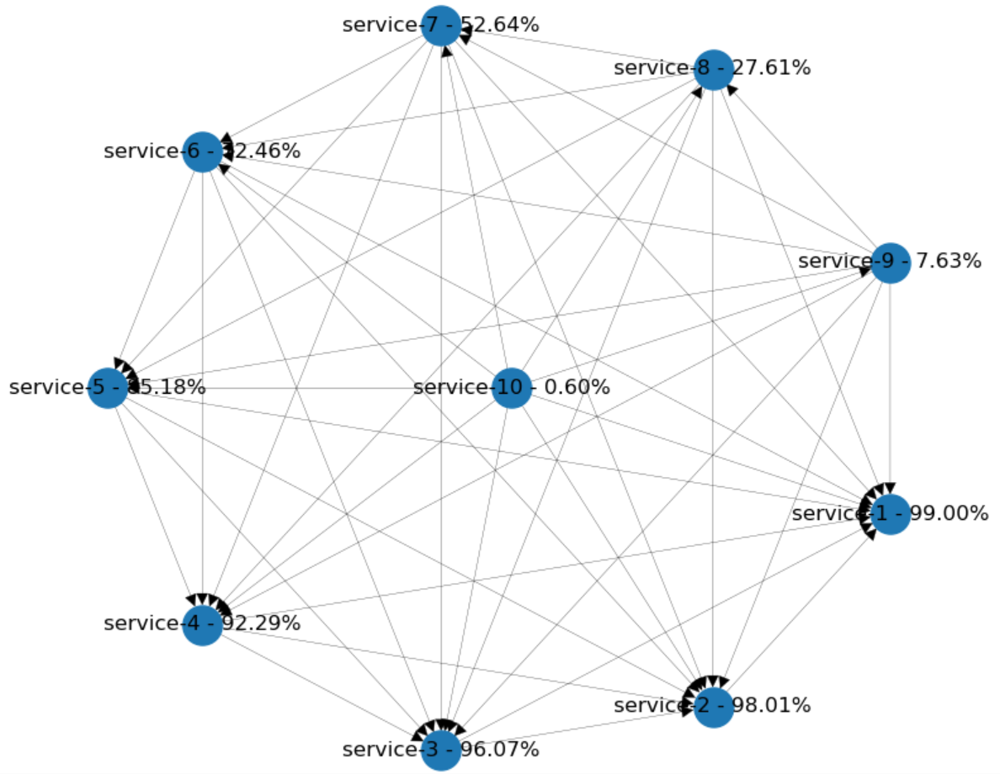
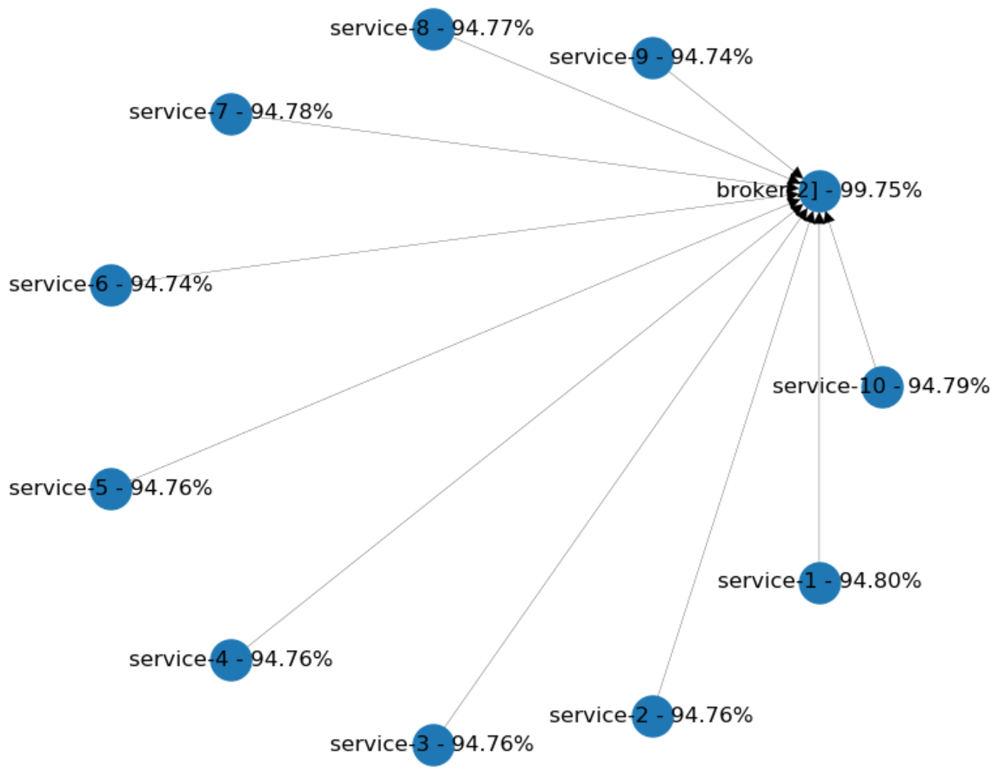

# Incorporating fault-tolerance into your microsevice design
Fault-tolerance is an essential trait of every microservice architecture. The reasons are plain simple: After integration points in our system reach a certain number, failures are going to happen on a daily basis. The reasons are simply statistical. As I will show it to the reader, we can't defy the laws of mathematics.

That's why we need to understand the key drivers of failures from a higher perspective. It's required to make strategic decisions effectively. Without these decisions it's impossible to achieve the level of fault-tolerance we aim for. 

# Types of failures
There are a plethora of different reasons for a service to fail. Without 
// TODO consider that switches, firewalls, anything between can also fail.

## Crash
The dependent service is not running and not responding to answers. The usual effect of this failure is getting back an exception on the client side.

## Hang
The dependent service is not responding to any answer, just keep chewing on the requests. The usual effect is getting a timeout on the client side

## Timeout
The service fails to response within the required time interval. Usually this only means that the client's timeout is lower than . The worst case scenario is when client retries.

## ...

# Understanding total system availability
## The model
I've created a simple [simulation][gihub-simulator-link] to model different kind of scenarios. All the results below were created by the aid of this software. At high level we don't really need a fully pfledged application with a real network stack to make these calculations. A tiny simulation is going to perform much faster and it's a lot simpler to build. It's allowing us to see the effect of scaling out our system to 100s of nodes, which would be hard to reach with real world scenarios.

## True story: Team obliged to maintain things on their own
I remember, that I was part of a team which had to provide maintenance to all the software running in 3 different environments: DEV, INT and even including PROD. There was no one else who provided support for keeping these applications alive. Back then, I had the feeling that we were reparing services on a daily basis. Not leaving time for any other activity, like coding and finishing up the milestones ahead of us. The infrastructure had many flaws. No healthchecks, no automatic restarts, we've just left using only SSH terminals and bash. One day I've counted all the different applications and components we had. In total there were almost 100 components we had to keep alive! So, let's say that we have 100 components with the "not-so-bad" 99% availability. What's the total availability of the system? In the center, we have the hapless developer. Let's assume that his availability 100% (because he's dedicated to do the job properly). The overall availability of the whole system, including all 100 components will reduce to just 36%! This means that there's no outage on one day out of 3 days. No wonder we had such a trouble making any progress.

# Serial and parallel connections
We will look at two simple examples first, to understand how dependency between each component will affect the whole system's availabilty. In brief, you can connect each one of the components either serial or parallel.

## Serial - e.g. application & database
In a serial connection both of the components should be available to serve incoming requests to the client. A service and it's database is a good example for this kind of configuration. In the example below, both component has a 95% availability in its own. Because of the dependency, the service's availability is reduced to 90%. The total availability of a serial connection is always lower, than the minimum availability of its components.

## Parallel - e.g. clustering
In a parallel connection only one of the components is required to be available to serve incoming requests to the client. Serving requests from a cluster is a good example, considering that the load balancing logic's availability is 100%. In real world scenarios, combining client-side load balancing with retries is close to this kind of setup. Let's see another example. Here, each component has 50% availability again. We should have the total availability of 75% after the simulation is finised. The failure rate is halved, which should leave us with 1 - 0.25 availability. The total availability of a parallel connection is always higher, than the availability of its components. Note, that in the python model we only allow parallel connections of the same service component.

# Decomposing your services - mesh and star
The described rules are coming into play first, when we're discussing how to decompose our system into multiple services. Let's imagine, that we've started with a design where every component is talking to each other without any limitation. The whole thing starts becoming a huge mess very fast and nobody understands why the site being down in the majority of the business hours. This situation can easily happen with "big bang" migration projects with a wrongly chosen service decomposition strategy. 

Let's start small and say, that we have only 10 services. Every newly added component will depend on all of the previously existing ones. This adds many layers of abstraction, but more importantly, lots of integration points to worry about! The dependency diagram of these kind of systems ofthen looks like a full mesh. In the python model I've added each service with 99% availability. Each newly added service will depend on all existing nodes. The last one in the middle with all the connections has the estimated availability below 1%!

What's the conclusion? How we could improve the overall situation? Well, it's nice to build atop of an existing functionality. But it's way too dangerous to encapsulate every dependency with a network call. We should aim for minimizing the number integration points and create larger services. Reuse dependencies using our dependency management and build system or even duplicate functionalities and implement them multiple times.
In a situation like this, reversing integration calls, merging services and reimplementing some of the functionalities can help.

## Shifting towards star topology
Now, let's see another topology. Let's assume that every component in our system is communicating through a "gateway". Will this change our availability balance towards a positive direction?

In the diagram below every service has 95% availability. Each one of them has only one dependency: The cluster of brokers in the middle. We're using 2 separate brokers with 95% availability. You can see, that the availability improved overall. Clustering increases availability of the brokers up to 99.75% and each service lost just a proportional amount of their of availability.

What are these examples telling us? So, if you really need to have such complexity in the dependencies between services it's better to use messaging as the communication channel. You'll need to look at enterprise integration patterns to figure out how to implement some of the most challenging scenarios.

Message driven architectures often have a message broker in the middle, implemented by Kafka or RabbitMQ or similar technology. The aim of this kind of setup is to keep pushing the common dependnecy's availability and reliability. This can be achived, more or less, by the following techniques.

### Eliminating single point of failures from deployments
Careful evaluation of the chosen technology's configuration can help you avoiding a lot of headaches. This is not so simple as it sounds and often needs dedicated personnel for properly provisioning the cluster for you.
If you're using cloud providers, check the availability of managed services. For instance AWS is offering SQS, SNS and managed Kafka clusters as well.

### Partitioning your brokers
Eveny if you're confident in the chosen technology, it's advisable to partition your cluster of brokers amongst the teams. It's going to help, when you need to roll out new configurations or improvements. For instance, you can deliver them to a single partition at first and then back off if something goes wrong. 

# Common microservice patterns and their effect on availability
Now, let's look at how we can apply what we've learnt by analyzing the most common microservice patterns. 

## CRUD services and aggregates
Often teams encapsulate specific data types with simple CRUD services, lacking any business logic. In these cases you have to push business logic in the layer above, usually into an aggregate which joins data by calling several CRUD services. As an alternative you can merge business logic together and just reduce the amount of integration points. But let's see a not-so straightforward scenario. Again, in this case the availability of each individual service is 95% in its own.

We have two CRUD services called by an aggregate. Let's suppose we want to get rid of an integration point, buy merging `another_crud` into `aggregate`. We suspect that the availability looked from the proxy's perspective will increase, so let's do a little simulation and examine the results.

Surprisingly we lost 6.5% of availability! But why? The reason is that we accidentally increased the outbound dependencies of the `aggregate` from 2 to 3. And this made our system's availabilty worse. 

So, the model showed us that we shouldn't stop there. We won't reach the desired effect until we merge both CRUD services into the `aggregate`, which will remind us to a bit more monolythic design.

## Chain of responsibility

# Summary

## Some fault-tolerance patterns and their possible effect
### retries
[Cassandra rapid read protection][cassandra-read-protection]
[gRPC retries][grpc-retries]
### fallback
### defaults

Not just circuit breakers or service mesh
// TODO GRPC features covering these
// TODO Istio features covering these

Each additional integration point has an additional cost, that needs to be mitigated. Here's a checklist on what to evaluate on each of the connections:

- Timeouts
- Retry policy
- Periodic connection validation
-- Connection pool rotation
- Circuit breakers
- ...

# Tools & Technoloiges

# Out of scope
[Traefik]: https://docs.traefik.io/v2.0/middlewares/ratelimit/
[CNCF proxies]: https://landscape.cncf.io/category=service-proxy&format=card-mode&grouping=category&license=open-source

# References
https://eventhelix.com/RealtimeMantra/FaultHandling/system_reliability_availability.htm
https://eventhelix.com/RealtimeMantra/FaultHandling/reliability_availability_basics.htm
https://www.os3.nl/_media/2013-2014/courses/rp1/p17_report.pdf
https://azure.microsoft.com/en-us/blog/microservices-an-application-revolution-powered-by-the-cloud/
https://www.edureka.co/blog/microservices-design-patterns#Branch

[cassandra-read-protection]: https://docs.datastax.com/en/archived/cassandra/3.0/cassandra/dml/dmlClientRequestsRead.html
[grpc-retries]: https://github.com/grpc/proposal/blob/master/A6-client-retries.md
[gihub-simulator-link]: https://github.com/gitaroktato/microservices-availability-simulator